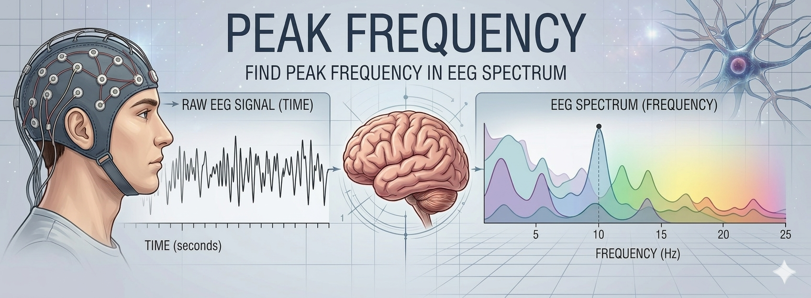

# 🧠 PeakFrequency

PeakFrequency is a pure-[Julia](https://julialang.org/) package for spectral peak detection and characterization in Electroencephalogram (EEG) power spectra.

In particular, it provides tools for:
- Estimation and removal of the aperiodic (1/f) spectral component,
- Detection of a dominant spectral peak within a user-defined frequency interval,
- Computation of the corresponding center of gravity (CoG),
- Channel-wise and subject-wise aggregation of peak-related spectral estimates.

The implemented procedures are grounded in standard spectral modeling approaches in which the EEG power spectrum is described as the sum of an aperiodic background and oscillatory components [^1] [^2].

The package includes:
> - *remove_aperiodic*, for estimating and removing the aperiodic spectral component,
> - *find_peak*, for detecting a spectral peak in a user-defined interval,
> - *peakFrequency*, for performing channel-wise and subject-wise peak estimation,
> - *reports_to_table*, for summarizing the results in tabular form.

Although the package is generic and band-independent, it is particularly suited to applications in which the estimation of an individual spectral peak and its center of gravity are of interest.

A detailed methodological report describing the theoretical rationale, aperiodic-component removal, generic peak detection, and multichannel subject-level aggregation is available [here](https://drive.google.com/file/d/1fnKw9hjp1Qd65Ii2fmmH_7MSKkYIxiIY/view?usp=drive_link).


## 📌 Index

- 📥 [Installation](#-installation)
- 📖 [Problem Statement, Notation and Nomenclature](#-problem-statement-notation-and-nomenclature)
- 📑 [API](#-api) 
- 📝 [Examples](#-examples)
- 🪪 [About the Author](#️-about-the-author)
- 📎 [Contribute](#-contribute)
- 🎓 [References](#-references)


## 📥 Installation

*julia* version 1.10+ is required.

This package is currently intended to be used **locally** from its project folder.

After downloading or cloning the repository, open the package folder in VS Code using **Open Folder**.

> [!IMPORTANT]
> The package relies on [`Revise`](https://timholy.github.io/Revise.jl/stable/) for local development.  
> Make sure `Revise` is installed in your Julia environment:
>
> ```julia
> using Pkg
> Pkg.add("Revise")
> Pkg.add(url="https://github.com/Lucreziadimarino/PeakFrequency.jl")
> ```

To build and load the package locally, execute the file:

```text
src/extras/LOCAL_BUILD.jl
```

[▲ index](#-index)


## 📖 Problem Statement, Notation and Nomenclature

We consider one or more EEG-derived power spectra and wish to identify, within a user-defined frequency interval, a dominant spectral peak and the corresponding Center of Gravity (CoG) [^8], while accounting for the presence of an aperiodic spectral background [^1] [^2].

Let

$\mathbf{s}     \in \mathbb{R}^{F}$   

be a single power spectrum, where $F$ is the number of frequency bins, and let

$\mathbf{S} \in \mathbb{R}^{F \times C}$

be a matrix of spectra, where each column corresponds to one channel and $C$ is the number of channels.

For subject-level analysis, the package operates on a collection of spectral objects

$\mathcal{S} = \{S^{(1)}, S^{(2)}, \dots, S^{(K)}\}$

where $K$ is the number of subjects and each subject-specific object contains a spectrum matrix

$S^{(i)}.y \in \mathbb{R}^{F \times C}$

The package addresses three related tasks:

1. **Aperiodic component modeling and removal [^1][^2]**  
   The selected spectral segment is modeled in the log-log domain as

   $\log P(f) = \beta_0 + \beta_1 \log f + \varepsilon(f)$

   where $\beta_0\$ is the intercept, $\beta_1$ is the spectral slope, and $\varepsilon(f)$ represents the residual oscillatory structure.

2. **Spectral peak detection  [^8]**  
   Within a user-defined interval $f \in [f_{\min}, f_{\max}]$\)$, the package identifies a dominant local maximum after iterative smoothing and weak-peak elimination

3. **Center of gravity estimation  [^8]**  
   Within the same interval, the spectral center of gravity [ is defined as

   $CoG = \frac{\sum_i f_i P(f_i)}{\sum_i P(f_i)}$

The final subject-level estimate is obtained by aggregating valid channel-wise estimates across a selected subset of channels [^3].

> [!TIP]
> The peak detector implemented in this package is intentionally **band-independent**. Although the package can be used in applications involving alpha-band peak estimation, the same procedure can be applied to any user-defined spectral interval.

> [!NOTE]
> The quality of the detected peak depends on several factors, including spectral resolution, the width of the selected frequency interval, the amount of smoothing required, and the prominence threshold used to eliminate weak maxima.

[▲ index](#-index)


## 📑 API

The package exports the following functions:

| Function | Description |
|:---------|:------------|
| [remove_aperiodic](#remove_aperiodic) | estimate and remove the aperiodic 1/f spectral component from one spectrum or a matrix of spectra |
| [find_peak](#find_peak) | detect a dominant spectral peak within a user-defined frequency interval |
| [peakFrequency](#peakfrequency) | run the complete multichannel pipeline for subject-level peak frequency and center-of-gravity estimation |
| [reports_to_table](#reports_to_table) | convert subject-level reports into a compact tabular summary |


[▲ index](#-index)

***

### remove_aperiodic

```julia
remove_aperiodic(spec::AbstractVector{<:Real}, sr::Real, t::Integer, frange)
remove_aperiodic(S::AbstractMatrix{<:Real}, sr::Real, t::Integer, frange)
```
Estimate and remove the aperiodic (1/f) spectral component within a user-defined frequency interval.

For a single spectrum, the function:

1. identifies the bins corresponding to frange,
2. models the selected spectral segment in the log-log domain as
 $\log P(f) = \beta_0 + \beta_1 \log f + \varepsilon(f)$,
3. estimates the regression coefficients $\beta = [\beta_0,\beta_1]$ by least squares,
subtracts the fitted background from the log spectrum,
reconstructs the corrected spectrum in the original domain.

If the input is a matrix, the same procedure is applied column by column.

**Return**

- For a vector input: the corrected spectrum and the coefficient vector β
- For a matrix input: the corrected spectra matrix and a 2 × nSpectra matrix of coefficients

[▲ API index](#-api)

[▲ index](#-index)

***

### find_peak

```julia
find_peak(spec::AbstractVector{<:Real},
          sr::Real,
          t::Integer,
          frange,
          maxiter::Integer,
          maxmins::Integer,
          maxmaxs::Integer;
          maxType::Symbol=:max,
          eliminateTh::Real=1.1,
          DC::Bool=false)
```

Detect a dominant spectral peak within a user-defined frequency interval.

The function:
1. restricts the analysis to the bins corresponding to frange,
2. applies iterative Blackman smoothing until the number of local minima and maxima is sufficiently reduced,
3. identifies local minima and maxima using a dominance criterion over the ±1, ±2, and ±3 neighboring bins,
4. removes weak maxima whose prominence relative to the closest minimum does not exceed eliminateTh,
5. selects the final peak according to maxType:
    - :max → highest remaining maximum
    - :first → first remaining maximum
    - :last → last remaining maximum

This function is intentionally band-independent and can be used for any spectral interval of interest.

Return

A NamedTuple containing:

ok : whether a valid peak was found
reason : diagnostic message
peakHz : detected peak frequency in Hz
peakBin : corresponding frequency bin
mins : detected minima bins
maxs : detected maxima bins
nsmooth : number of smoothing iterations
spectrum : final spectrum used for peak detection

[▲ API index](#-api)

[▲ index](#-index)

***

### peakFrequency

```julia
peakFrequency(𝐒::AbstractVector, sr, t, frange, maxiter, maxmins, maxmaxs;
                                 maxType::Symbol = :max,
                                 eliminateTh::Real = 1.1,
                                 minValidChannels::Int = 1,
                                 channels::AbstractVector, 
                                 DC::Bool = false)
```

Run the complete multichannel pipeline for subject-level peak-frequency estimation.

For each subject, the function:

1. selects the channels to be analyzed,
2. removes the aperiodic component from each selected channel by calling remove_aperiodic,
3. detects a spectral peak in each corrected spectrum by calling find_peak,
4. computes the center of gravity (CoG) in the same frequency interval,
5. aggregates valid channel-wise estimates into a subject-level peak frequency and CoG.

The package operates on spectral objects whose field .y contains a matrix of size frequency × channels.

The center of gravity is computed as

   $CoG = \frac{\sum_i f_i P(f_i)}{\sum_i P(f_i)}$

A subject-level estimate is considered valid only if at least minValidChannels channels yield a valid peak.

Return

- OK : global boolean flag, true if all subjects have a valid estimate
- PF : vector of subject-level peak frequency values (Hz)
- CoG : vector of subject-level center-of-gravity values (Hz)
- OKvec : boolean vector indicating whether each subject has a valid estimate
- reports : vector of NamedTuples containing the main diagnostic information for each subject

[▲ API index](#-api)

[▲ index](#-index)

***

### reports_to_table

```julia
reports_to_table(reports)
```

Convert the vector of subject-level reports returned by peakFrequency into a compact tabular summary.

The resulting DataFrame contains one row per subject and the following columns:
- OK : boolean flag indicating whether the estimate is valid
- PF_Hz : subject-level peak frequency (Hz)
- CoG_Hz : subject-level center of gravity (Hz)

This function is intended for quick inspection, reporting, and downstream analysis.


[▲ API index](#-api)

[▲ index](#-index)


## 📝 Examples

The examples below illustrate a typical workflow with `PeakFrequency`, from aperiodic-component removal on a single spectrum to subject-level multichannel peak estimation. 

### Example 1 — Peak detection on realistic simulated data

In this example, we simulate an EEG-like time series, compute its power spectrum, remove the aperiodic component, and detect the dominant spectral peak within a user-defined frequency interval.

```julia
using Random, Statistics, FFTW, Plots
using DSP, FourierAnalysis, PeakFrequency

Random.seed!(42)

# --- 1. Simulation parameters ---
sr = 128                     # Sampling rate (Hz)
t_duration = 10              # Signal duration (s)
t_axis = 0:1/sr:t_duration-(1/sr)
n = length(t_axis)

# --- 2. Realistic aperiodic component (1/f-like noise) ---
freqs_sim = rfftfreq(n, sr)
χ, offset = 1.6, 0.1
noise_floor = 0.005 * mean(1 ./ (freqs_sim .+ offset).^χ)

aperiodic_spectrum = (1 ./ (freqs_sim .+ offset).^χ) .+ noise_floor
phases = 2π .* rand(length(freqs_sim))
noise = irfft(sqrt.(aperiodic_spectrum) .* exp.(im .* phases), n)

# --- 3. Oscillatory component ---
peak_freq = 10.0
amplitude_modulation = 1.0 .+ 0.4 .* sin.(2π * 0.5 .* t_axis)
oscillation = 0.7 .* sin.(2π * peak_freq .* t_axis) .* amplitude_modulation

# --- 4. Final EEG-like signal ---
eeg_signal = (noise ./ std(noise)) + oscillation

# --- 5. Power spectrum (Welch's method) ---
# Use a 128-sample window so that the spectrum matches fdf(sr, 128; DC=false)
window_samples = 128
overlap_samples = 64
pwelch = welch_pgram(eeg_signal, window_samples, overlap_samples; fs=sr)

f_welch = freq(pwelch)
p_welch = power(pwelch)

# Remove the DC bin to match PeakFrequency convention with DC=false
f_pf = f_welch[2:end]
spec = p_welch[2:end]

# --- 6. PeakFrequency analysis ---
frange = 8:13

# Step A: remove aperiodic component
spec_detr, β = remove_aperiodic(spec, sr, window_samples, 1:45)

# Step B: find the peak on the corrected spectrum
pk = find_peak(spec_detr, sr, window_samples, frange, 10, 2, 2)

# --- 7. Visualization ---
p = plot(f_pf, log10.(spec),
         title = "Simulated EEG Power Spectrum",
         xlabel = "Frequency (Hz)",
         ylabel = "Log Power",
         lw = 2,
         color = :black,
         label = "Original spectrum")

plot!(p, f_pf, log10.(spec_detr),
      lw = 2,
      linestyle = :dash,
      color = :blue,
      label = "Aperiodic-corrected spectrum")

vspan!(p, [first(frange), last(frange)],
       alpha = 0.12,
       color = :gray,
       label = "Search range")

if pk.ok
    peak_idx = argmin(abs.(f_pf .- pk.peakHz))

    vline!(p, [pk.peakHz],
           color = :red,
           lw = 1.5,
           label = "Detected peak: $(round(pk.peakHz, digits=2)) Hz")

    scatter!(p, [pk.peakHz], [log10(spec_detr[peak_idx])],
             color = :red,
             label = "")
else
    @warn "Peak detection failed: $(pk.reason)"
end

xaxis!(p, (1, 30))
display(p)
```
***

### Example 2 — Test on real data

For a more comprehensive demonstration using real EEG recordings, the repository includes a dedicated example script together with a sample dataset.

To test the package on real human EEG data, open the package root folder and run:

```bash
julia examples/example.jl
```

> [!NOTE]
> The example script illustrates how to load, process, and analyze multichannel EEG data using the functions provided by PeakFrequency.

The example showcases the following workflow:

1. **Data loading**
Raw EEG-derived spectra or EEG data are loaded from the example-data folder included in the repository.
2.  **Spectral analysis**
Spectral estimates are computed or loaded for each electrode.
3. **Batch peak estimation**
The package functions are applied across multiple channels and subjects, including aperiodic-component removal and peak detection for each channel.
4. **Result summarization**
Peak frequencies, center-of-gravity values, valid channels, and estimated aperiodic coefficients are collected into a compact summary structure or table.


[▲ index](#-index)


## 🪪 About the Author

[Lucrezia Di Marino](https://www.researchgate.net/profile/Lucrezia-Di-Marino-2) is a PhD student in Information and Communication Technology for Health (ICTH) at of the University of Naples Federico II. 
**Contact**: lucrezia.dimarino2@unina.it

[Marco Congedo](https://sites.google.com/site/marcocongedo) is a Research Director of [CNRS](http://www.cnrs.fr/en) (Centre National de la Recherche Scientifique), working at [UGA](https://www.univ-grenoble-alpes.fr/english/) (University of Grenoble Alpes). 
**Contact**: first name dot last name at gmail dot com.

[▲ index](#-index)


## 📎 Contribute

Please contact the author if you are interested in contributing.

[▲ index](#-index)


## 🎓 References

[^1]: Dickinson, A., DiStefano, C., Senturk, D., & Jeste, S. S. (2018). Peak alpha frequency is a neural marker of cognitive function across the autism spectrum. European Journal of Neuroscience, 47(6), 643–651.

[^2]: Gyurkovics, M., Clements, G. M., Low, K. A., Fabiani, M., & Gratton, G. (2021). The impact of 1/f activity and baseline correction on the results and interpretation of time-frequency analyses of EEG/MEG data: A cautionary tale. NeuroImage, 237, 118192.

[^3]: Corcoran, A. W., Alday, P. M., Schlesewsky, M., & Bornkessel‐Schlesewsky, I. (2018). Toward a reliable, automated method of individual alpha frequency (IAF) quantification. Psychophysiology, 55(7), e13064.

[^4]: Angelakis, E., Lubar, J. F., Stathopoulou, S., & Kounios, J. (2004). Peak alpha frequency: an electroencephalographic measure of cognitive preparedness. Clinical Neurophysiology, 115(4), 887–897.

[^5]: Smit, C. M., Wright, M. J., Hansell, N. K., Geffen, G. M., & Martin, N. G. (2006). Genetic variation of individual alpha frequency (IAF) and alpha power in a large adolescent twin sample. International Journal of Psychophysiology, 61(2), 235–243.

[^6]: Di Flumeri, G., Aricò, P., Borghini, G., Sciaraffa, N., Di Florio, A., & Babiloni, F. (2019). The dry revolution: Evaluation of three different EEG dry electrode types in terms of signal spectral features, mental states classification and usability. Sensors, 19(6), 1365.

[^7]: Chiang, A. K. I., Rennie, C. J., Robinson, P. A., Van Albada, S. J., & Kerr, C. C. (2011). Age trends and sex differences of alpha rhythms including split alpha peaks. Clinical Neurophysiology, 122(8), 1505–1517

[^8]: Klimesch, W. (1999). EEG alpha and theta oscillations reflect cognitive and memory performance: a review and analysis. Brain Research Reviews, 29(2–3), 169–195.


[▲ index](#-index)